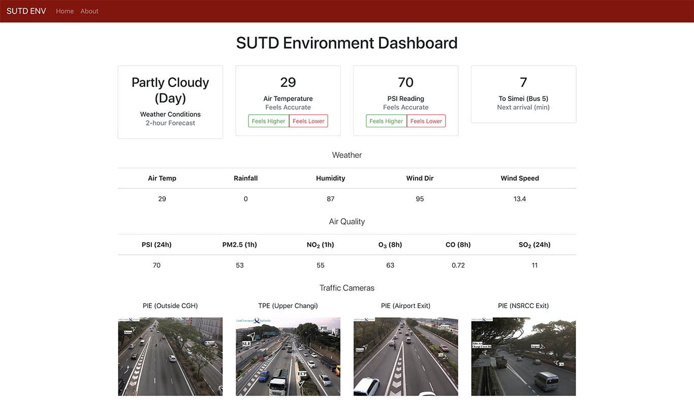

# SUTD Environment Dashboard

* Main part is suppose to be the Flask REST API
* But the frontend look good
* Also is pretty cool so maybe we'll do this for OpenSUTD



## API Calls

**GET**

* `/air_quality`: PSI and PM2.5 readings (JSON)
* `/pollutants`: various pollutant readings (JSON)
* `/weather`: 2h weather forecast (JSON)
* `/traffic_cam`: the image from the 4 nearest traffic cameras from SUTD (JSON)
* `/next_bus_simei`: next bus time to Simei (JSON)
* `/get_votes`: returns if PSI or temperature feels higher or lower

* `/`: returns the front-end HTML page
* `/about`: returns the front-end about page

**POST**

`POST` functions are authenticated.

* `/vote_item`: vote if a reading feels higher or lower
* `/reset_votes`: reset all vote counts

## Running

Follow the steps below (only tested on Ubuntu and macOS).

```shell
git clone git clone https://github.com/tlkh/sutd-env
cd sutd-env
pip install requirements.txt
python3 server.py

# browser navigate to `http://localhost:5000`
```
